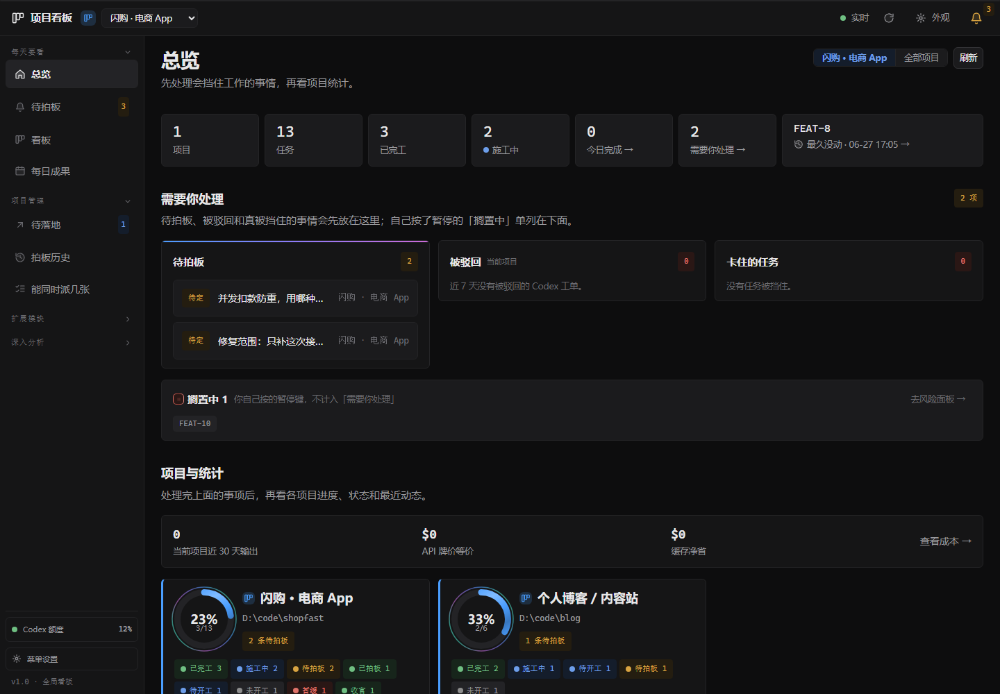
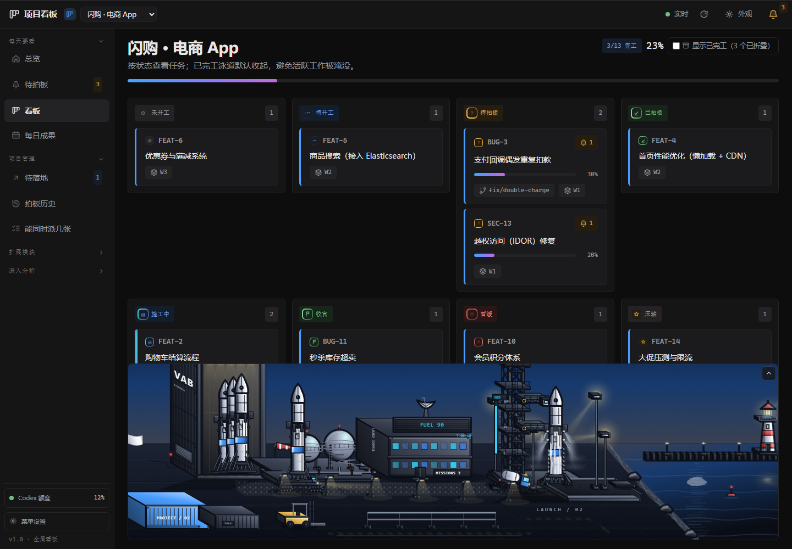
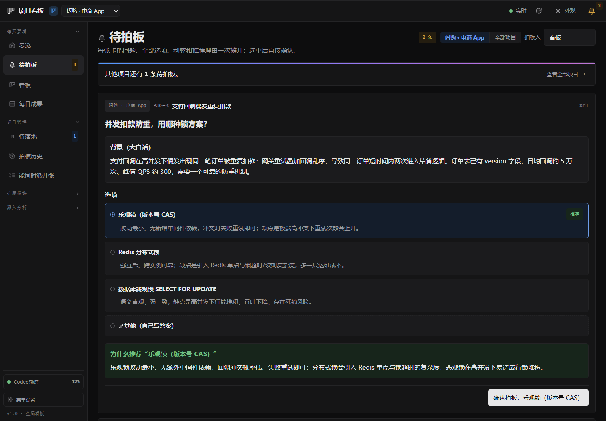
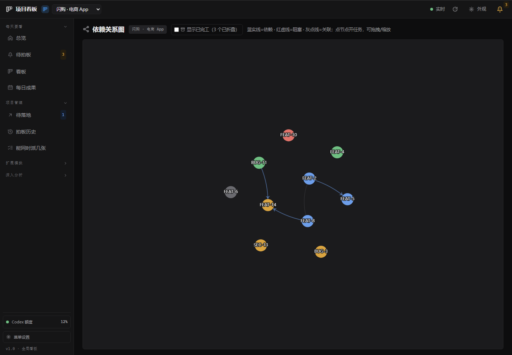
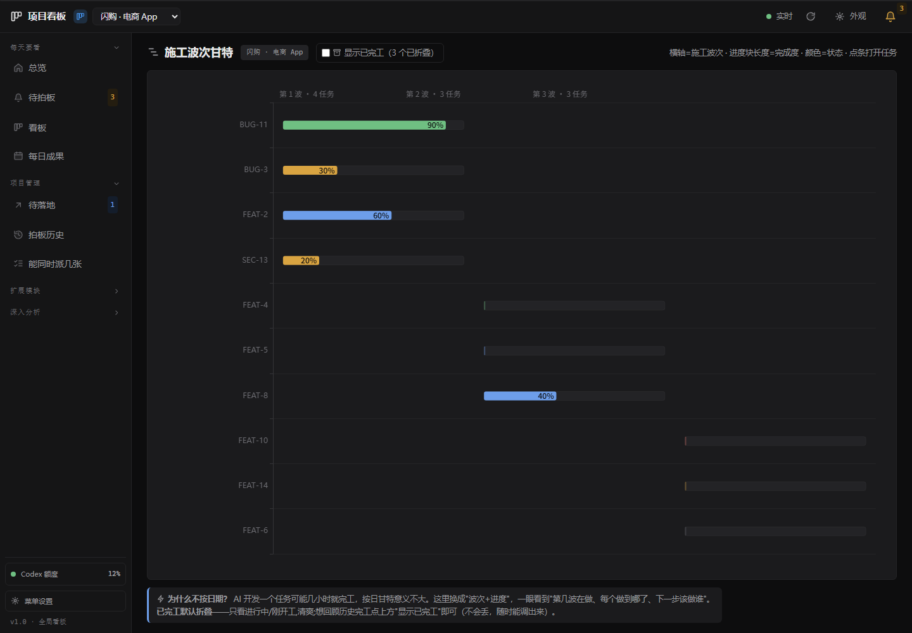

# Project Dashboard

[中文说明](README.md)

A local project board for work carried out by AI agents. Agents report progress through a command-line protocol; you follow the work, answer decisions and send feedback from one dashboard.



## What it is

Project Dashboard brings several repositories into one view. Each project's board records tasks, ownership, progress, dependencies and decisions. It runs on your computer and serves its interface on `127.0.0.1`.

The repository provides a Node.js command-line tool and HTTP server with no runtime package dependencies, plus a Vue interface. The Windows installer bundles its own Node.js runtime.

## Why it is different

The person doing the work also maintains the record. An agent claims a task before editing code, reports progress and raises a decision with options, a recommendation and tradeoffs. You answer the decision, and the board tracks whether that answer has been implemented.

Git hooks can synchronize commits and enforce task claims across tools. The protocol lives in the CLI, so collaborators can ask for the current rules instead of copying an outdated command list into every prompt.

## Highlights

- One overview for several projects, with tasks, blockers, decisions and daily results.
- Decisions followed through from the question to implementation.
- Automatic refresh when a project's board changes.
- 20 views, including dependency graphs, timelines and four optional modules.
- Configurable navigation that keeps your saved groups and ordering.
- Local files for project data, with the CLI as the board's write channel.

The default daily navigation contains **Overview, Decisions, Board and Daily Results**. The **Codex panel, Cost, CPU and Reader** modules are disabled by default. Enable them under **Menu settings → Extension modules**, or in `DASHBOARD_HOME/settings.json`:

```json
{
  "modules": {
    "codex": true,
    "cost": false,
    "cpu": false,
    "reader": false
  }
}
```

Without a custom `DASHBOARD_HOME`, settings live in `~/.claude/dashboard/settings.json`. The startup environment variable `DASHBOARD_MODULES=codex,cost` overrides the file; `all` enables all four modules. Disabled modules have no sidebar entry, their routes redirect to Overview, and their APIs return 404. `/api/health` reports the effective switches. The Codex panel reads jobs from the code repository of the project selected in the top bar.

## Screenshots

**Task board**



**Decision center**



**Dependencies**



**Timeline**



The screenshots use the existing demonstration data. Navigation can differ with your settings and enabled modules.

## Quick start

### Windows installer

1. Download `ProjectDashboard-Setup-vX.X.X.exe` from [Releases](../../releases/latest).
2. Run the installer, then open Project Dashboard from the desktop or Start menu.
3. Use the Add Project shortcut to register a repository.
4. Give your AI tool the repository's [AGENTS.md](AGENTS.md) protocol.

The installer includes Node.js; a separate Node installation is unnecessary.

### From source

Use **Node.js 24** and its bundled npm:

```bash
git clone https://github.com/TPP2002/project-dashboard.git
cd project-dashboard
npm ci
npm --prefix web ci
npm --prefix web run build
npm start
```

The server opens a browser and prints its address. A source checkout uses the development port range starting at 6070; installed or released copies normally start at 6060.

Register a project through the CLI if needed:

```bash
node cli/index.cjs register --id example --name "Example" --root /path/to/repository
node cli/index.cjs protocol --project example
```

### Isolated demo

After installing dependencies and building the frontend above, run:

```bash
npm run demo
```

This seeds two fictional projects into a temporary `dashboard-demo-<pid>` directory and starts a separate instance on a port starting at 6099. All four optional modules are enabled for exploration. It uses its own project registry and boards. Press **Ctrl+C** to stop it. The temporary data is left in the operating system's temporary directory.

## Supported AI tools

Any tool that can read project instructions and run shell commands can report to the board.

| Tool | Integration |
| --- | --- |
| Claude Code | Project instructions and optional Git hooks |
| Codex, Cursor, Gemini CLI, Copilot | Put the protocol in the tool's project instruction file |
| Other agents or scripts | Call the CLI directly |

Start with [AGENTS.md](AGENTS.md) and the [integration guide](docs/接入其它AI模型.md). Use `protocol` for the rules, `brief` for a task's current instructions, and each command's `--help` for exact arguments. Claim work before editing, and include the task ID in commit messages.

## Boundaries

This is a local supervision and decision tool for agent-led work. It assumes a trusted local user and provides no multi-user accounts or permission system. Board edits go through the CLI; supported browser actions forward to that same channel.

The four optional modules serve the maintainer's personal workflow. Their switches control availability and navigation. Enabling the Codex panel exposes its existing dispatch and resume operations; those operations require the corresponding local tooling. The main dashboard remains usable with all four modules disabled.

## Documentation

- [User guide](docs/看板使用手册.md) — how to use the interface (Chinese).
- [Product manual](docs/产品手册-PRODUCT-MANUAL.md) — architecture, data model and CLI reference (Chinese).
- [AI tool integration](docs/接入其它AI模型.md).
- [Contributing](CONTRIBUTING.md) — setup, checks and collaboration rules.
- [Changelog](CHANGELOG.md).

## Privacy

The server binds to localhost. The project registry, boards and settings are local files; enabled cost and Codex modules read local activity records. There is no required cloud dashboard account.

An explicitly configured event webhook can send selected task events to your chosen endpoint. AI dispatch and resume commands use the external tools you have installed and configured. Avoid putting credentials or private logs in public issues.

## License

**To be decided.** The maintainer will add the project license after choosing it; no project license file is included yet. Bundled third-party software retains its own licenses; installer notices describe those components.
