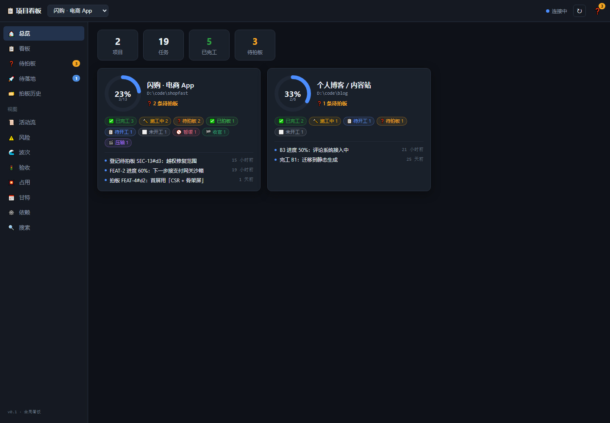
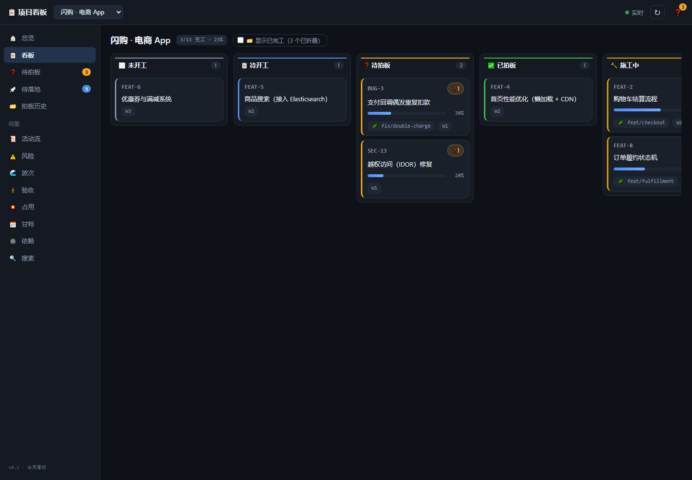
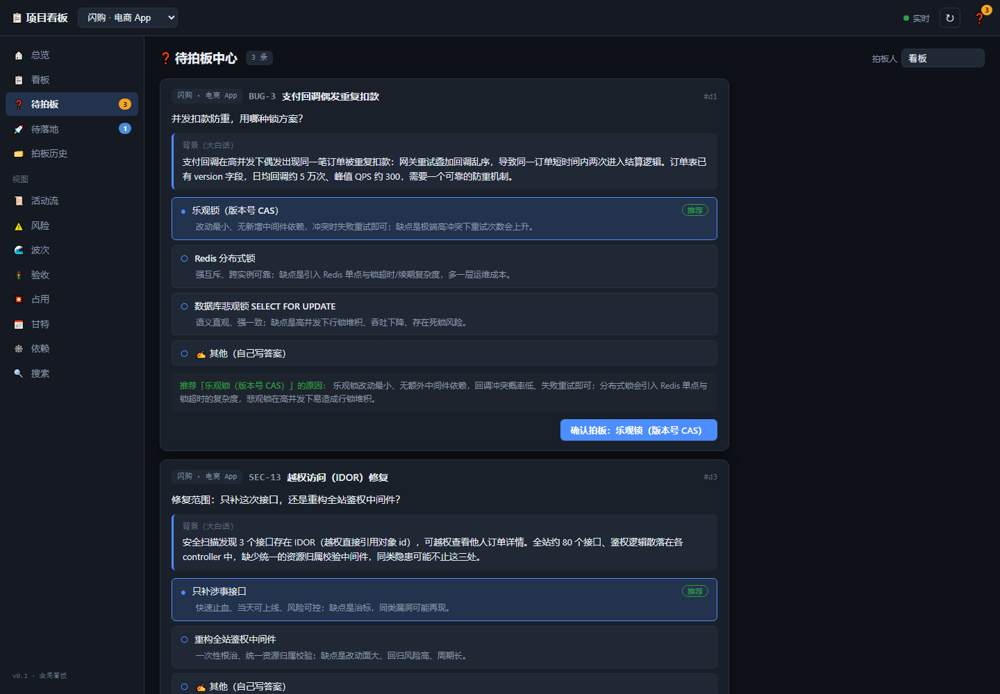
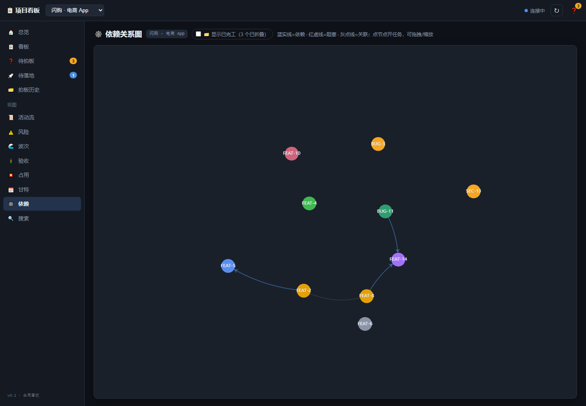
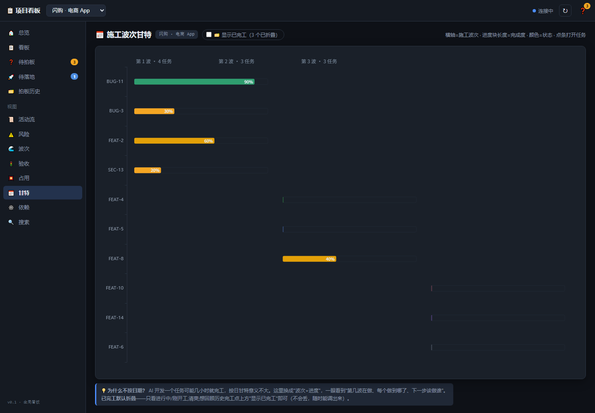

<div align="center">

# 🗂️ 项目管理看板 · Project Dashboard

**给「AI 干活」用的项目看板——AI 自己更新进度，你只在岔路口拍板。**

*An AI-native project board: your AI agents update it, you just approve the forks.*

一个**本地运行、零云端、双击即用**的多项目看板。你把任务派给 AI（Claude Code / Cursor / Codex / Gemini …），
AI 一路把「认领 → 进度 → 待拍板 → 完工」写回看板；你只负责**看进度**和**在关键岔路口拍板**。

</div>



---

## 💡 它和别的看板/工具，到底哪不一样？

市面上的 AI 工具大多在做「**让 AI 替你干活**」（帮你跑 agent、并行、发 PR）。
传统看板（Jira / Trello）则要**你手动挪卡、改状态**。

**这个东西站在中间的空档：它是「AI 的监工台 + 决策台」——**

> 🤖 **AI 建链、AI 更新**：任务的状态/进度/决策由 AI 经命令行写回，你**不用手动挪一张卡**。
> 🙋 **你只做三件事**：看进度、在岔路口拍板、把新活派给 AI。
> 🧭 **这正是它区别于传统敏捷看板的地方**——不是让你更勤快地维护看板，而是让你**根本不用维护它**。

如果你完全不接 AI、只想用鼠标手动管任务，那你要的是传统看板，不是它。

---

## ✨ 亮点

- 🧠 **AI 原生**：看板是 AI 汇报进度的「权威账本」，不是给人填的表格。
- ✅ **拍板闭环**：AI 遇到岔路口 → 摆出选项 + 推荐 + 利弊 → 你一键拍板 → 追踪到「是否落地」。
- 🗂️ **多项目一屏**：手里几个项目，谁做到哪、卡在哪、有啥等你拿主意，一眼看全。
- 🖥️ **本地 · 零云端 · 隐私**：只在你电脑上跑（`127.0.0.1`），不联网、不上传、卸载即净。
- 📦 **双击即用**：Windows 一键安装包，内嵌运行时，**不用装 Node、不用碰命令行**。
- 🔌 **跨模型**：Claude Code 开箱即用；Cursor / Codex / Gemini / Copilot / 任何能跑命令的工具都能接（见下）。
- 📊 **13 个视图**：总览、看板、待拍板、依赖图、波次甘特、风险、占用冲突、验收、活动流…
- ⚡ **实时刷新**：AI 一有进展，页面几秒内自动更新，变化的卡片黄色闪一下。

---

## 📸 截图

**看板：AI 干到哪、卡在哪，一眼看全**



**待拍板中心：AI 摆出选项 + 推荐 + 每项利弊，你一键拍板**



<details>
<summary>📂 更多视图（依赖图 / 波次甘特）</summary>





</details>

---

## 🚀 快速开始

### 方式 A：一键安装包（推荐，零门槛）

1. 到 [**Releases**](../../releases/latest) 下载 `项目管理看板-安装程序-vX.X.X.exe`。
2. 双击安装（首次运行 Windows 可能提示 SmartScreen → 点「更多信息」→「仍要运行」；未签名，正常现象）。
3. 桌面/开始菜单出现「项目管理看板」，双击启动 → 浏览器自动打开。
4. 第一次是空的？双击「**添加项目**」把你的项目文件夹加进来。
5. 之后让你的 AI（如 Claude Code）在这个项目里干活即可——它会自动把进度写进看板。

> 内嵌 Node 运行时，**无需预装 Node.js、无需联网**。约 22MB，per-user 安装（不需要管理员权限）。

### 方式 B：从源码跑（开发者）

```bash
git clone https://github.com/TPP2002/project-dashboard.git
cd project-dashboard
npm --prefix web install && npm --prefix web run build   # 构建前端
node server/server.cjs                                    # 起服务（自动开浏览器）
```

---

## 🤖 支持哪些 AI / 模型？

**看板本体与模型完全无关**：任何能执行一条命令的东西（AI、脚本、甚至你自己）都能更新它——
核心是让施工方运行 `node cli/index.cjs claim / progress / done …` 把状态写回。

| 工具 | 接入方式 |
|---|---|
| **Claude Code** | ✅ 开箱即用（读 `CLAUDE.md` 协议 + git hook 自动同步 + 未认领拦提交的闸门） |
| **Cursor / Codex / Gemini CLI / Copilot** | 给它一份「家规」文件即可（`.cursor/rules`、`AGENTS.md`、`GEMINI.md`、`copilot-instructions.md`），告诉它「动代码前先 `cli claim`、干完 `cli done`」。模板见 [`AGENTS.md`](AGENTS.md) 与 [接入其它 AI 模型](docs/接入其它AI模型.md) |
| **任何能跑 shell 的 agent / 脚本** | 直接调 CLI 即可 |

> 补充：`post-commit` / `pre-commit` 等 **git 钩子天然跨工具**（谁提交都触发），
> 所以「提交自动同步」和「没认领就拦提交」这两条对所有工具都生效。

---

## 🧭 定位边界（是什么 / 不是什么）

- ✅ **是**：AI 驱动开发的**监工台 + 决策台**，本地、多项目、读多写少。
- ❌ **不是** SaaS / 云看板（无账号、无服务器、默认只本机访问）。
- ❌ **不是**团队协作工具（无多人权限、评论、通知、移动端）。
- ❌ **不是**手动挪卡的传统看板——写入是 AI 的活，人只「拍板」。

---

## 📖 深入了解

- 📘 [**产品手册（PDF）**](docs/产品手册-PRODUCT-MANUAL.pdf)｜[Markdown 版](docs/产品手册-PRODUCT-MANUAL.md) — 架构、数据模型、CLI 全集、关键设计决策+为什么、边界。
- 📗 [使用手册（大白话图文）](docs/看板使用手册.md) — 教你看懂每一屏、怎么在网页上拍板。
- 🔌 [接入其它 AI 模型](docs/接入其它AI模型.md) — 让 Cursor / Codex / Gemini / Copilot 也能开箱接入。

### CLI 常用命令（`node cli/index.cjs <命令> --project <id>`）

| 命令 | 用途 |
|---|---|
| `register --id --name --root` | 注册项目 |
| `claim <id> --branch` | 认领任务 → 施工中 |
| `progress <id> --percent` | 回写进度 |
| `pending <id> --q --opt… --rec` | 登记待拍板问题 |
| `decide <id> --did --answer` | 拍板 |
| `done <id> [--pr --commit]` | 完工 |
| `list` / `show <id>｜--pending` | 查询 / 待拍板中心 |

---

## 🔒 隐私与安全

- 只绑 `127.0.0.1`，**仅本机访问**；不联网、不上传任何数据。
- 数据只存在本地（项目列表 + 各项目 `.dashboard/board.json`）。
- 读文档接口有路径越界防御；网页写操作只有「拍板」一项，且经校验。

---

## 📄 许可与致谢

- 安装包内嵌 [Node.js](https://nodejs.org)（MIT）作为运行时，详见安装目录内 `NOTICE-第三方声明.txt`。
- 本项目自身许可由作者决定。

<div align="center">

**AI 干活，你拍板。** 🗂️

</div>
